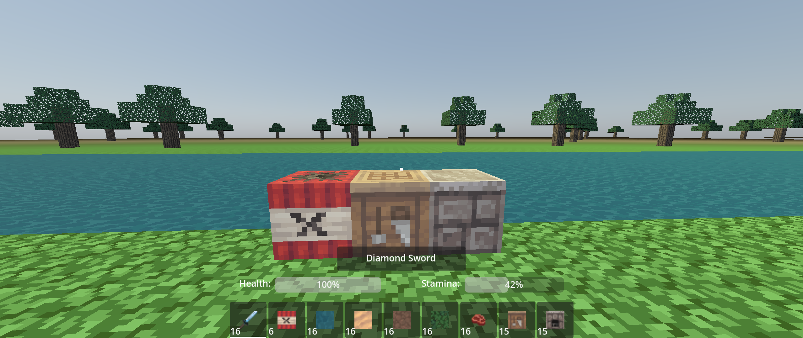
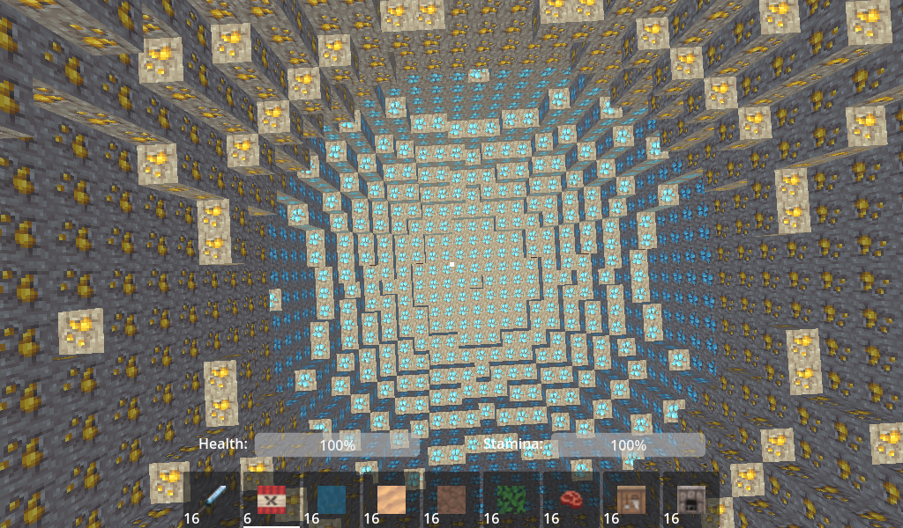

# Godot Voxel Game

Voxel survival game using Zylann's [voxel module](https://github.com/Zylann/godot_voxel) for Godot 4.0.

## How to run the game
To run the game you need to get a build of Godot 4 with Zylann's voxel module installed.
The current godot engine build I am using can be found [here](https://github.com/Zylann/godot_voxel/actions/runs/3028543632).

## Game information
More detailed information on the game can be found in the [game-info.md](./meta/game-info.md) file.

## Assets
The textures can be found [here](https://github.com/Athemis/PixelPerfectionCE/tree/master).
Sound effects obtained from https://www.zapsplat.com
