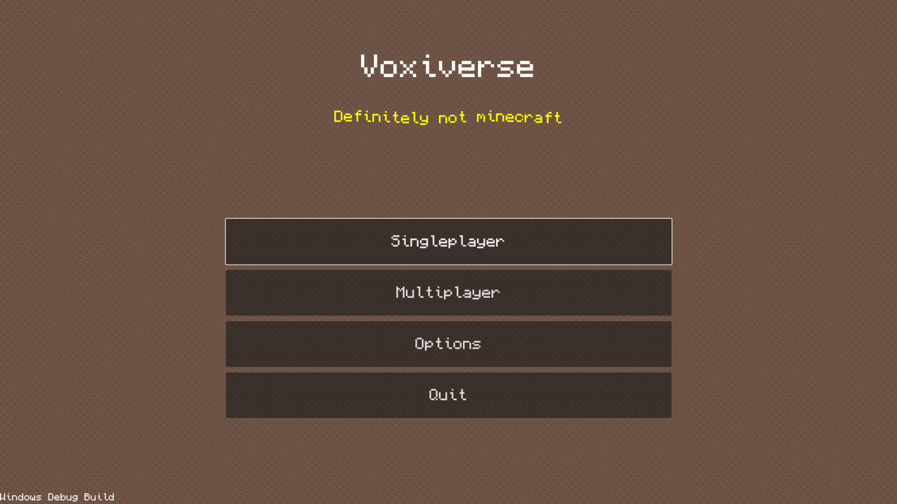
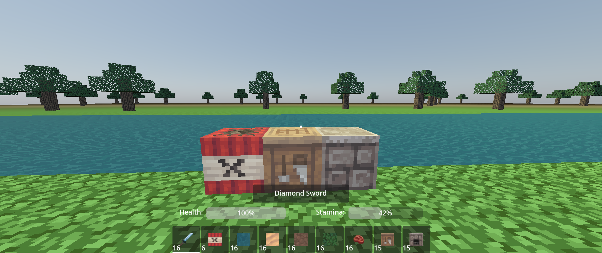
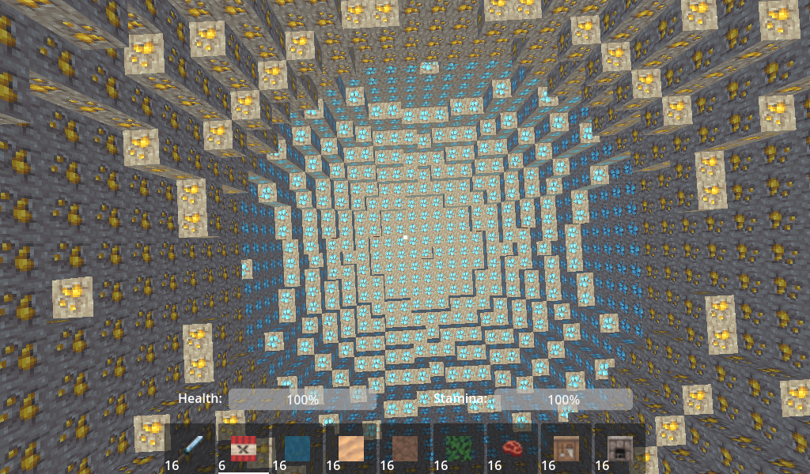

# Godot Voxel Game

Voxel survival game using Zylann's [voxel module](https://github.com/Zylann/godot_voxel) for Godot 4.0.

## Running the game
To run the game you need to get a build of Godot 4 with Zylann's voxel module installed.
The current godot engine build I am using can be found [here](https://github.com/Zylann/godot_voxel/actions/runs/3028543632).

## Project information
More information on the project can be found in the [meta/documentation](./meta/documentation/) folder.

## Assets
The minecraft textures are from the [PixelPerfectionCE](https://github.com/Athemis/PixelPerfectionCE/tree/master) texture pack.
Some sound effects are obtained from https://www.zapsplat.com.
Icons from free and open-source icon section of [Font Awesome](https://fontawesome.com/)
Various other assets are from https://kenney.nl.
